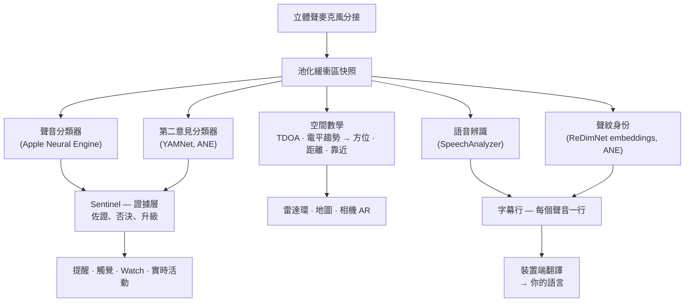
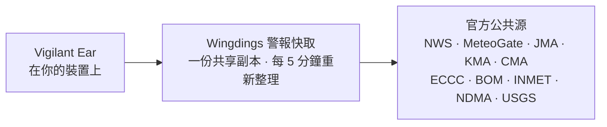

# Vigilant Ear 👂🛡️

*自 1.1.8 版起生效 · 2026 年 9 月。*

## 為聽不到聲音的人準備的聲學雷達。

這是一款專為聾人、重聽及 CODA 群體打造的應用。大多數聲音識別應用只會告訴你聲音是*什麼*。**Vigilant Ear 還能告訴你聲音在哪裡、是誰發出的，以及他們在說什麼** —— 把 iPhone 變成一臺實時聲學三錄儀，描述你周圍的聲音。

警笛的方向和距離。身後的敲門聲。對話裡的人被畫成各自獨立的轉錄聲線 —— 每人都有字幕和方向定位。如果有人說的是你看不懂的語言，他們的話可以**譯成你的語言。** 提醒會送到你的**鎖定螢幕、靈動島和 Apple Watch**，瞥一眼就夠。

要緊的事都在裝置上完成。音訊不會為了識別而被錄製或上傳。任何環節都不依賴聽力。

- 🧭 **不只是檢測，還有方向。** *是什麼、在哪裡、是誰，* 以及 *說了什麼* —— 而不只是「有聲音」。
- 🔒 **天生注重隱私。** 分類、字幕和翻譯都在你的 iPhone 上執行。字幕是實時且短暫的；不會當作轉錄存檔儲存。
- ⌚ **在手腕和鎖定螢幕上。** Apple Watch 方向伴侶 + 實時活動 (Live Activity)，讓最近一次提醒及其方向始終一眼可見。
- 🛰️ **多部手機，共享同一只耳朵。** Constellation（星座）把支援超寬頻 (Ultra-Wideband) 的 iPhone 連起來，把每臺手機聽到的內容融成更清晰的方向圖景。
- 👁️ **為聾人 / 重聽 / CODA 而做。** 獨特觸覺、高對比視覺、不依賴顏色的提示、足夠大的點選目標，並全程尊重「減弱動態效果 (Reduce Motion)」。

---

## 為誰而做

- **希望掌握聲音環境態勢的聾人、重聽及 CODA 使用者** —— 居家值守（敲門、警報、嬰兒、電話）和街頭值守（警笛、靠近），可以一直開著並放心依賴。
- 任何需要**帶方向與說話人分離的實時字幕**，或需要對身邊人做**裝置端翻譯**的人。
- 對裝置端聲音定位感興趣的輔助功能與聲學研究使用者。

> Vigilant Ear 是輔助功能**輔助工具**，不是經認證的生命安全裝置。

---

## 它能做什麼

### 🧭 看見聲音 —— 方向與距離
利用 iPhone 的兩隻麥克風，Vigilant Ear 測出聲音的**角度，以及它在你前方還是後方**，把讀數穩定在大約一度，並以實時標記畫在朝上的雷達環和地圖上。同一直線上的兩隻麥無法單獨分清左右 —— 右側 50° 與左側 50° 的聲音到達時差相同 —— 所以應用會畫出讀數，並在另一側加一個**更淡的虛影**；轉一下手腕或用第二部手機就能定下來。距離按街景標定曲線從響度估算，並如實顯示為估計值：*約 50 英尺*，並給出可能範圍。你一移動，標記會保持在真實世界位置。這就是核心：對你聽不到的世界的空間感知。（具體數字見下文。）

### 🚨 識別重要聲音 —— 並提醒你
裝置端分類器可識別數百種日常聲音，並盯住關鍵類別 —— **警笛、警報（含專門的汽車警報類）、門鈴/敲門、嬰兒哭聲、附近的人，以及惡劣天氣。** 一旦觸發，你會得到清晰的螢幕提醒、可選的**推送通知**，以及獨特的**觸覺反饋** —— 即使應用在背景或手機在休眠。關鍵類別預設就緒，所以開啟通知並不等於「什麼都報」。關掉全部提醒類別後，引擎在背景會完全休眠以省電。**Sentinel** 層會用獨立證據 —— 方向、運動和公共資料來源 —— 交叉核對提醒，因此觸發的是經過佐證的結果，而不是單個分類器的孤立猜測。雙向都成立：歌曲裡像警笛的一瞬會被按住，但真實警笛反覆穿過你的音樂時仍會突破並提醒。

惡劣天氣警告來自官方公共訂閱源 —— 美國 **NWS**、歐洲 **MeteoGate**、中國 **CMA**、韓國 **KMA**、日本 **JMA**、加拿大 **ECCC**、澳大利亞 **BOM**、巴西 **INMET** 和印度 **NDMA** —— 對所有使用者免費。訂閱源會收窄到覆蓋你所在位置的那些。在日本，應用還會讀取 JMA 的**提前通報** —— 颱風或暴雨來臨前數日發出的白話說明，而不只是危險已至時的警告 —— 以及突發性強降雨與山體滑坡通報。提前通報安靜展示，不用留給真正警告的聲音和震動。

### ⌚ Apple Watch + 實時活動 —— 一瞥即知
- **Apple Watch 伴侶** —— 提醒方向會指在你手腕上，瞥一眼就知道往哪看。重新設計的 Watch UI 帶有應用耳朵圖示、威脅 HUD 佈局，以及雙擊關閉提醒。即使 Watch 應用未開啟，提醒仍可顯示方向箭頭。
- **實時活動** —— Vigilant Ear 會留在你的**鎖定螢幕**、**靈動島**和 **Watch 智慧疊放 (Smart Stack)** 上，最近一次提醒及其方位始終一眼可見。
- **夥伴提醒直達手腕** —— 已連結的 Constellation 夥伴手機發出提醒時，也可送到你的 Watch，並帶方向。可靠性最佳化讓手錶端伴侶全天對電池都很輕。

### 💬 說話人模式 —— 實時、定向字幕 *(免費)*
開啟**說話人模式 (Speaker Mode)**，Vigilant Ear 會把附近說話的人轉錄成**字幕塊，每個聲音一塊。** 裝置端說話人分離 (diarization) 讓聲音保持可區分 —— *誰* 在說 *什麼* —— 並在內環給出方向提示。當前說話人高亮；空間不夠時，較早的文字會滾出去。

多數字幕應用做不到的兩件事：**對置信度誠實** —— 每行細微的質量標記，以及可疑詞下的虛線下劃線，告訴你何時可信、何時該再核對 —— 以及**自我修正**：句子落地後，應用會帶著完整語境重讀音訊，可在約兩秒內補回漏聽或聽錯的詞，隨後文字凍結。

**可以遮蔽不當用語**（偏好設定 → 字幕）。否則這些詞會以純文字直接出現在字幕裡，沒有任何緩衝，讀的人也來不及移開視線；開啟後，這些詞會被替換為符號，句子去掉那個詞仍然讀得通。什麼算不當用語由你裝置自己的語音辨識決定，而不是我們的詞表，因此它跟隨正在轉寫的語言。在宣告為未滿 18 歲的賬戶上始終開啟並顯示鎖標記。它作用於*本機*轉寫的語音；從已配對手機轉來的文字是在那一端轉寫的，抵達時已是成品。

**說話人加重的那個詞會以粗體顯示。** 同一句話，重音落在哪裡決定了它是兩句不同的話，而字面相同的轉寫會把這一差別完全丟掉。應用會找出聲音在音高上抬起的那一個詞並加粗——每行至多一個，拿不準時一個也不加，因為標錯詞等於替別人說了他沒說的話。在中文和日文中關閉：在這些語言裡，音高表明的是*這是哪個詞*，而不是它被強調的程度。

字幕免費；自動翻譯是可選的 Power Pack+ 層。字幕也可**朗讀到你的藍牙聽力裝置** —— 免費，在偏好設定裡開啟。**方向音 (Direction Tones)**（同樣免費，在偏好設定 → 字幕）可在你選定的一側耳朵加入可選音訊提示，標出說話人方位 —— 對助聽器或單側聽力很有用，也向所有人開放。

### 🌐 自動翻譯 —— 你的語言，實時 *(Power Pack+)*
在說話人模式開啟時，附近的人若說另一種語言，Vigilant Ear 可以檢出並用**你的語言**呈現其字幕，同時在其字幕塊上顯示源語言。聽 → 分離說話人 → 轉錄 → 翻譯 → 顯示 的整條鏈在**裝置端**執行；唯一需要網路的時刻是從 Apple 一次性下載語言包。你不必事先知道或選擇對方語言。

這是目前最接近科幻裡**萬能翻譯器**的量產形態 —— 裝置直接聽懂。Vigilant Ear 自行檢測語言，跟上房間裡每一位說話人，並把所有人的話以你的語言字幕呈現 —— 無需耳機、無需設定，全程在裝置上。

### 🎵 音樂與廣播感知 *(Power Pack+)*
**ShazamKit** 識別周圍播放的音樂並跟蹤歌曲切換。

### 🎛️ 聲學示波器 —— 像工程師一樣看聲音
以專業級實時檢視呈現周圍聲音：頻譜、語譜圖、1/3 倍頻程 RTA 頻段、色度與諧波分音 —— **所有人免費。** 用於採集聲音、訓練自定義聲音包的工具屬於 Power Pack+。

### 📦 自定義聲音包 —— 教它認識你的世界 *(Power Pack+)*
教 Vigilant Ear 識別對你重要的聲音 —— 從本地鳥鳴到樓門門鈴。擴展包疊在內建檢測之上，新聲音絕不會擠佔警笛和警報。應用內附分步指南。

### 🛰️ Constellation —— 多部 iPhone，共享同一只耳朵 *(Power Pack+)*
用兩部或多部支援超寬頻的 iPhone（自 iPhone 11 起的大多數機型），**Constellation** 將它們配對，使彼此能感知位置，並把各自聽到的內容融成更精確的聲源圖景 —— 一個分散式無源監聽陣列。字幕也會融合：每部手機轉錄自己麥克風聽到的內容，再跨機對齊，讓離說話人最近的那部貢獻所聽內容 —— 只有一部手機聽到的詞會被保留，而不是丟掉。手機之間**直接連線** —— 無需路由器、無需同一 Wi-Fi 網路，也無需網際網路；只要開啟 Wi-Fi，走的是 AirDrop 同一條點對點鏈路。僅限具備相應硬體的裝置。早於對等端連線時間的網格字幕不會被重傳。

**夥伴訊息** —— 向已連結夥伴的手機發一條短訊；它會出現在對方的字幕流中，並可在裝置端譯成對方語言後送達。訊息顧及年齡：基於 Apple 的宣告年齡範圍（Declared Age Range），成年人與未成年人之間的簡訊保持關閉，除非雙方都主動為對方命名。提醒和字幕從不受限 —— 僅限人對人簡訊。

### 🔗 遠端連線 (Remote Link) —— 聯絡不在身邊的人 *(先需 Power Pack+ 才能發起)*
本可用電話做的事，改用影片和文字完成。你發出邀請碼；對方在 Vigilant Ear 內加入，**不必擁有 Power Pack+**。與 Constellation 不同，沒有近距離要求 —— 兩人可以在任何地方。

**全程不使用音訊。** 只有影片和文字，因此鏈路兩端都不依賴聽力 —— 也讓你能透過應用與對方手語交流。應用本身不理解手語；它只承載影片，其餘由你們完成。連線在網路允許時在兩部手機間直連，應用會清楚標明是**直連 (Direct)** 還是**中繼 (Relayed)**，讓你始終知道影片是否經中繼。

### 📷 相機 AR —— 「看見聲音」
在標題欄開啟相機膠囊，把檢測到的聲音釘在實時畫面中的真實方位。標記按說話人或聲音類別與方向聚類，保持可讀；聲源安靜後會隨時間淡出。

### 🗺️ 地圖、道路與路徑預測
聲音方位投影到地圖上的真實 GPS 座標。車輛聲可**吸附到附近街道**並預測路徑，於是路過的卡車讀起來像在*沿路*移動，而不是穿樓而過。（可試消防車演示。）

### 🪄 功能遊樂場 —— 不必靠聽力也能驗證
**功能遊樂場**對所有人公開：居家與街頭練習（敲門、警報、嬰兒、警笛、天氣）、多機與對話演示，以及清晰水印，確保練習絕不偽裝成真實事件。關閉面板會乾淨拆除演示（無卡住的 GPS 欺騙，無殘留標誌）。

### ♿ 輔助功能優先
為聾人 / 重聽 / CODA 與色盲使用者打造：**不依賴顏色**的提示，**≥44 pt** 點選目標，尊重**減弱動態效果 (Reduce Motion)**，多模態提醒（觸覺 + 視覺 + Watch），以及啟動驗證屏，用清晰的綠 / 灰 / 紅（以及焦橙「不允許」）狀態顯示權限 —— 包括充當主提醒開關的通知授權。

---

## 免費與 Power Pack+

安全核心**永久免費**：

- **居家值守與街頭值守** —— 本地聲音提醒（警報、警笛、敲門/門鈴、嬰兒、附近的人），支援螢幕、觸覺與可選推送。
- **實時字幕** —— 說話人模式，裝置端，在硬體允許時帶方向；含誠實的置信度標記、約 2 秒自我修正、可選朗讀到藍牙聽力裝置，以及方向音。
- **常駐值守 (Standing Watch)** —— 房間自身狀態，始終開啟且無需配置：房間保持慣常模式時是穩定青燈；出現變化 —— 新聲音、突然安靜，或有東西靠近 —— 變為琥珀。
- **惡劣天氣警報** —— 適用於你所在地區的 NWS、MeteoGate（歐洲 —— 由我們的 5 分鐘警報快取新鮮提供）、CMA、KMA、JMA（日本）、ECCC（加拿大）、BOM（澳大利亞）、INMET（巴西）和 NDMA（印度）。
- **地震警報（USGS，全球）** —— 附近有地震報告時，你會感到震動，並在地圖上看到有感區域。來自 USGS 官方源的確認 —— 不是預警：若你感到晃動，它告訴你那是什麼。裝置端深層震感（次聲）檢測可在地面一動時啟動核實。
- **功能遊樂場** —— 帶清晰 PREVIEW 水印的練習提醒與功能預覽。
- **Apple Watch 伴侶與實時活動** —— 可一眼看到的方向與最近提醒。
- **聲學示波器** —— 專業級實時聲音視覺化，所有人免費。（用於訓練的採集工具屬 Power Pack+。）

**Power Pack+** 是一次性解鎖（**不是訂閱**），含 **90 天免費試用**。它增加這些超能力：

- **自動翻譯** —— 將附近語音在裝置端譯成你的語言。
- **Constellation** —— 經超寬頻的多 iPhone 共享聽力，並支援夥伴訊息。
- **音樂辨識** —— ShazamKit 歌曲識別。
- **自定義聲音包** —— 可自行訓練的擴展分類器。

無論免費還是 Power Pack+，**你的音訊都會留在裝置上做識別** —— 層級只改變解鎖哪些功能，絕不改變原始音訊被送到何處分析。

---

## 它如何工作（幕後）

Vigilant Ear 是**本地優先、裝置端**的分層流水線：捕獲一次，再讓彼此獨立的專長模組讀同一段聲音並互相核對。原始音訊在高優先順序分接點捕獲，複製進**池化緩衝區空閒列表**（實時路徑上無分配抖動），再分發出去且不卡住 UI：

沒有任何單一模型被單獨信任。**Sentinel** 層夾在檢測與提醒之間：獨立引擎逐幀互相佐證或否決 —— 當反覆出現的真實世界證據壓過否決時（例如真實警笛穿過你的音樂），證據勝出，提醒發出。

字幕也有第二次機會。每句定稿後，會從短時記憶體音訊環帶著完整語境安靜重讀 —— 修正約在兩秒內落地，隨後文字永久凍結：

- **空間數學** —— FFT、相干加權到達時間差（TDOA —— 偏愛兩隻麥一致的頻段，再把微小到達時差變成方位），以及電平趨勢靠近跟蹤，均在背景任務上執行。麥克風對按固定朝向讀取，因此無論豎持還是橫持，方向表現一致。
- **語音** —— iOS 26 `SpeechAnalyzer` / `SpeechTranscriber` 負責轉錄；**ReDimNet** 說話人嵌入負責聲紋身份；Apple 的 **Translation** 框架負責裝置端翻譯。聲紋身份基於證據：只有獨立聲音視窗才能確認真實人物；不確定匹配顯示為未歸屬，而不是猜錯名字。
- **音樂真偽** —— 色度**歌曲特徵檢測器**掌管「是否真在放音樂」的判定，因為通用分類器常把靜室和警笛叫成「音樂」。只有特徵同意確有音樂時，Shazam 才會執行。
- **併發** —— Swift 6 隔離讓麥克風分接、聲學數學與 UI 渲染迴圈乾淨分開。
- **效率** —— 降取樣、負載自適應分類，以及按證據門控的網路使用，使始終聆聽輕到可以一直開著。

天氣和地震預警走與音訊相反的路徑 —— 你的聲音從不外送，但警報*資料*會進來。**每一路**官方源都經我們運營的小型快取，一次抓取公共資料即可服務所有使用者 —— 你的手機從不直接聯絡外國政府伺服器：

---

## 你的手機能聽見什麼 —— 實測

你的 iPhone 有相距約六英寸的兩隻麥克風、氣壓計，以及非常好的時鐘。這足以告訴你聲音從哪邊來、大概多遠、是否朝你靠近，以及門是否剛開啟。下面是各項有多準、我們如何核對，以及若你自己聽不到聲音時為何重要。方向及相關資料於 2026 年 9 月在 iPhone 17 與 iPhone 16 Pro Max 上測得。距離本質上仍是估計 —— 我們在螢幕上也會這麼說。

**方向 —— 大約到一兩度。** 聲音先到上麥或先到下麥，應用據此算出聲音偏離手機軸線多遠，以及在前還是在後。手機兩路並不是樸素麥克風，而是處理後的立體聲影象；房間一吵，該影象會疊上固定模式。應用現在會在啟動後幾秒安靜裡學會該模式，並在讀方向前去掉它。

| 我們測了什麼 | 結果 |
|---|---|
| 96 個模擬房間（安靜辦公室到硬牆房間，5 dB SNR）的中位誤差 | 1.0° |
| iPhone 17 放桌上、房間有噪聲、揚聲器偏離軸線 30° | 相對側平面讀到 61.7°，期望 60°，晃動 1.6° |
| 同上，揚聲器正對手機側面 | 讀到 4.5°，期望 0°，晃動 2.2° |
| 同上，揚聲器正前方 | 每次都在最大時延，符合預期 |
| 讀數落在影象自身模式而非聲音上 | 任意角度均為無 |

*為何重要：* 若你聽不到警笛，「在你身後偏一側」告訴你往哪看。只有對照捲尺核對過的穩定讀數才值得信；這一項核對過兩次，第二次是在第一次被發現過於寬鬆之後。

**距離 —— 按估計值如實顯示。** 單隻麥克風測不了距離，只能測響度；遠處的大卡車可能聽起來像近處的安靜小車。應用用真實街道擬合的曲線從響度估距離，並像謹慎的人那樣表述：*大約 50 英尺，可能在 25 到 100 之間。*

| 我們測了什麼 | 結果 |
|---|---|
| 經標定回放的真實車輛檢測 | 1,131 |
| 落在實際所在 100 英尺道路內 | 73% |
| 遠車道車輛 | 估為 78 與 87 英尺，捲尺為 73 與 85 英尺 |

道路（城市路口）按車道逐條丈量；曲線出錯時偏近側。標定由自動化測試鎖定，避免靜默漂移。你自己空間內的警報（如煙霧警報器）完全不給距離 —— 它們已與你同室。

**運動 —— 朝你靠近。** 對車輛和警笛，變響通常意味著變近。應用觀察幾秒內電平上升多快：約每秒持續升高 1.5 dB（清晰穩定的變響）視為靠近，對稱下降視為離開；若不再變化，約四秒後不再稱為靠近或離開。單次巨響 —— 按喇叭、摔門 —— 無法觸發。建立在物理與九項自動化測試上；錄製的街道駛過是下一步實地確認。

**房間裡的空氣 —— 門有簽名。** 氣壓計能察覺約十四英尺外開門：門擺開時氣壓下探，關上時回彈。在十四小時安靜與十五次門事件中，每扇門都做出這兩段形狀，屋裡別無他物如此。

| 事件 | 氣壓變化率 | 形狀 |
|---|---|---|
| 前門開合，×10 | 0.6–1.8 Pa/s | 下探再回彈，約相隔 5 秒 |
| 前門猛關，×5 | 1.1–2.5 Pa/s | 同一對，更高 |
| 夜間空調迴圈，×8 | 0.11–0.46 Pa/s | 數分鐘慢坡，兩部手機相同 |
| 安靜房間 | ~0.02 Pa/s | 無 |
| 走過、打噴嚏 | — | 運動感測器察覺，手機忽略 |

紗門不密封房間，因此不可見 —— 本應如此。今天氣壓變化可在地圖上顯示為深層隆隆；專用的靜夜開門提醒已測完並設計好，尚非日常預設。

**Constellation —— 兩部手機定下左右。** 網格上每部手機從所在位置朝聲音畫一條線，線條只在一側乾淨相交。相交後虛影消失，應用又能說左或右。模擬中，相距 **40 米** 的兩部手機，把 50 米外的警笛定位到約 2 米以內。

**這裡任何數字如何被採信。** 每個數字都按同一三道關，依次：答案預先已知的模擬房間；復現會騙過應用的精確情形、並在每次改動時執行的小型自動化測試；再到真實桌上的真機，距離手測。挺不過第三關，就不算準。對聽不到聲音的人，應用的話是唯一的話 —— 它該像實驗室那樣掙來。

給工程師的更深筆記：[Physics](https://vigilantear.com/en/physics/) —— TDOA、距離、運動、Constellation 與氣壓檢測，每個數字標有 MEASURED / BENCHED / MODELLED。

---

## 隱私

- **核心流水線始終在裝置上。** 分類、空間數學、轉錄、說話人分離與翻譯都在你的 iPhone 上執行。原始音訊不會為識別而被錄製或上傳。
- **字幕是短暫的。** 實時字幕只在會話期間留在記憶體；匯出的除錯日誌不含字幕文字。
- **無廣告或行為分析 SDK。** 有限網路僅用於地圖、公共天氣源、可選 Shazam 指紋、道路環境與 App Store 購買 —— 詳見完整政策。

完整詳情：[PRIVACY.md](/zh-Hant/privacy/) · [TERMS.md](/zh-Hant/terms/) · [SUPPORT.md](/zh-Hant/support/)

---

## 硬體與平臺

- **iPhone（完整體驗）。** 豎屏橫屏皆可 —— 想怎麼拿就怎麼拿。測向需要立體聲麥克風。推薦 **iPhone 13 或更新機型**。
- **Apple Watch。** 帶方向箭頭的伴侶提醒；支援實時活動 / 智慧疊放。
- **iPad（原生）。** 自適應佈局：大屏上，實時字幕在地圖旁半透明面板中，無人講話時收起。單通道麥克風 → 有字幕但無完整方向。
- **Constellation** 需要**超寬頻 (Ultra-Wideband)** —— iPhone 11 或更高，不含 SE 與 「e」 型號。**不需要** Wi-Fi 網路：只要開啟 Wi-Fi，手機即可直接發現彼此，因此無路由器、無網際網路時，只要彼此靠近即可用。
- **Android。** 獨立版本，含核心雷達、提醒、字幕與天氣；Constellation 網格以 iOS 為先。隨 Android 對等完善，請關注產品站更新。

---

## 本地化

完全本地化 —— 介面、提醒與字幕 —— 支援**英語、西班牙語、葡萄牙語（巴西）、法語、德語、義大利語、土耳其語、阿拉伯語、日語、簡體中文、韓語、俄語和印地語**（13 種語言）。遵循系統區域設定，或可在應用內手動選擇。

---

## 狀態與免責宣告

Vigilant Ear 是**實驗性聲學輔助功能工具**，不是經認證的生命安全公用設施。定位解析度隨環境、天氣、風力與麥克風硬體而變。**請始終保持你慣常的環境意識** —— 不要把它當作安全資訊的唯一來源。

部分能力（相機 AR 標記、在 Apple 授予後升級的緊急提醒 (Critical Alerts) 權利、高階多包聲音創作）仍在演進；免費的居家 / 街頭值守與實時字幕，才是你從第一天起就能信任的產品。

---

**聯絡方式：** [vigilantear@wingdingssocial.com](mailto:vigilantear@wingdingssocial.com)

為聾人 / 重聽群體與聲學研究傾心打造 ❤️。

    
  <strong>© 2026 Wingdings, Inc.</strong> 
  All rights reserved. 
  Patent Pending

